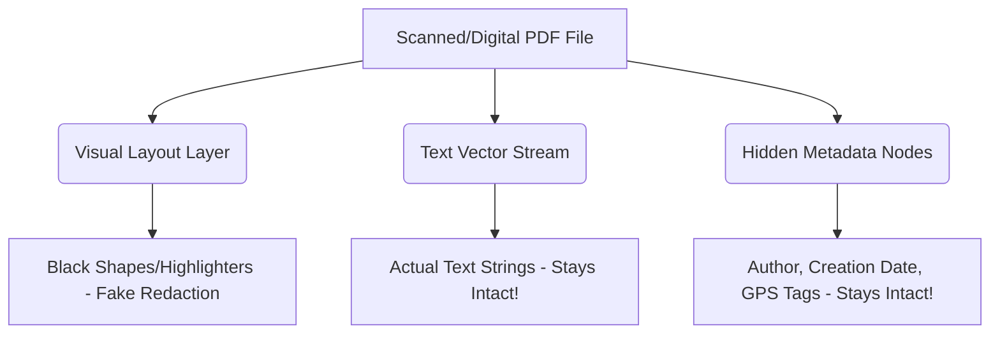

# How to Permanently Redact a PDF: Free Secure Black-Box Censoring Guide

Have you ever needed to share a PDF contract, tax document, or corporate memo, but had to censor a bank account number, a Social Security number, or a confidential client name first? 

If so, you likely did what millions of professionals do every week: opened the document in a basic PDF viewer or Microsoft Word, selected the rectangle drawing tool, and placed a solid **black box** over the sensitive text. 

To the naked eye, the information looks completely hidden. You save the file, email it to your recipient, and believe your privacy is safe.

**This is a catastrophic security mistake.**

Using drawing shapes, highlighter pens, or font color overrides to censor documents is one of the most common causes of massive corporate data leaks and legal embarrassment. Bad actors don't need advanced hacking skills to bypass mock redactions—they can simply highlight your black box, copy the selection, and paste it into a blank Notepad document to read the underlying text in clear, plaintext characters!

As an economics student and digital systems developer based in Bihar, India, I study security protocols and user document workflows. I built GoluPDFs to solve this exact issue: creating a professional, 100% free **Secure Black-Box PDF Redaction Tool** that runs entirely inside your browser sandbox, physically destroying underlying vector data and scrubbing hidden metadata.

In this comprehensive guide, we will analyze the technical anatomy of PDF layers, explain why standard drawing tools fail, detail the process of deep metadata hygiene, and provide a step-by-step tutorial on how to permanently redact your PDFs for free.

---

## 1. The Mock Redaction Trap: Why Simple Black Boxes Fail

To understand why mock redactions fail, we must look at how digital document files are structured. 

When you use a program like Microsoft Word or preview editors to place a black box over text, the computer does not erase the words. Instead, it adds a **new vector object layer** (the rectangle) exactly on top of the existing **text layer**.

This creates two critical vulnerabilities:

### A. The Copy-Paste Vulnerability
Because the text layer still exists underneath the black shape, anyone who opens the PDF can:
1.  Press `Ctrl + A` (or `Cmd + A` on Mac) to select all text.
2.  Press `Ctrl + C` to copy.
3.  Paste into text editors like Notepad, Word, or an email body. 
The black vector rectangle is ignored during text selection, and your hidden text is revealed instantly.

### B. The Object-Layer Stripping Vulnerability
Advanced users can open your PDF in design tools like Adobe Illustrator, CoreLDraw, or free PDF editors, click on the black rectangle layer, and simply tap the `Delete` key. The black box disappears, exposing the underlying confidential words.

> [!WARNING]
> **High-Profile Legal Disasters:** In several high-profile legal filings (such as the federal court case of Paul Manafort in 2019), lawyers submitted "redacted" PDFs where they simply colored the background of sensitive paragraphs black. Journalists copied the blacked-out paragraphs, pasted them into text documents, and instantly exposed confidential federal grand jury details.

---

## 2. PDF Anatomy: Understanding Vector Layers & Metadata

A standard PDF document is not a flat image file. It is a highly complex database of vector draw streams, font libraries, text arrays, and structural metadata.

### The Vector Stream
Text characters in a PDF are written as positioned vector coordinate streams:
`BT /F1 12 Tf 72 712 Td (Confidential Social Security: 000-12-3456) Tj ET`
When a basic app draws a black box on top, it simply appends a shape drawing operation at the end of the page stream, leaving the `(Confidential Social Security: 000-12-3456)` string completely untouched inside the file data.

### The Hidden Metadata Sins
Even if you manage to destroy the text, files contain hidden metadata nodes called **XMP (Extensible Metadata Platform) Data**. This includes:
*   **Document Properties:** Author name, company title, and original software keys.
*   **Revision History:** Previous titles, edit timestamps, and document descriptions.
*   **Search Index Snippets:** Google and search engines can read hidden text cached inside the XML metadata schemas, indexing your "censored" information publicly.

---

## 3. Technical Parameters of Private Metadata Scrubbing

To guarantee absolute security, a professional redaction tool must perform deep **Data Hygiene**. This means permanently stripping the following parameters:

1.  **XMP Meta-Blocks:** Complete removal of `<x:xmpmeta>` XML tags that house tracking variables.
2.  **Document Info Dictionary:** Deleting structural dictionary fields (`/Title`, `/Author`, `/Subject`, `/Creator`, `/Producer`, `/CreationDate`, `/ModDate`).
3.  **Embedded Thumbnails:** Removing small image previews embedded in the PDF dictionary, which might still show the unredacted pages in file previews.
4.  **Annotations & Comments:** Stripping historical sticky notes, draw markups, and structural highlights.

---

## 4. Technical Comparison: Drawing Blocks vs. Deep Redaction vs. Rasterization

| Redaction Feature | Standard Drawing Tool (e.g., Preview/Word) | Flatten/Rasterize to Image | GoluPDFs Deep Coordinate Redaction |
| :--- | :--- | :--- | :--- |
| **Visual Look** | Black box overlay. | Black box overlay. | Black box overlay. |
| **Security Status** | 🔴 **Extremely Vulnerable** (Text is easily copied). | 🟢 **Safe** (Converts vector text to flat pixels). | 🟢 **100% Secure** (Physically deletes underlying bytes). |
| **File Quality** | High-definition vector fonts remain intact. | 🔴 **Poor Quality** (Makes text blurry, scanned appearance). | 🟢 **Perfect Quality** (Unredacted text remains sharp vector). |
| **Metadata Removal** | 🔴 **No** (Retains original author, stamps, and histories). | 🔴 **No** (Scanner metadata remains intact). | 🟢 **Yes** (Scrubs all XMP and dictionary properties). |
| **File Size Impact** | Negligible change. | 🔴 **Huge Increase** (Converts text pages to heavy images). | 🟢 **Zero Overhead** (Clears data structures, often shrinking file). |

---

## 5. The GoluPDFs Solution: Browser-Side Coordinate Lock Redaction

Many websites run redaction by uploading your files to cloud servers. However, sending high-value tax forms, passports, or legal contracts to remote cloud networks is a massive security hazard.

GoluPDFs utilizes a **Serverless Local Redaction Engine** compiled via WebAssembly:

When you use our **[Free PDF Redaction Studio](https://golupdf.online/tools/redact-pdf)**:
1.  **Coordinate Locking:** As you draw a redactive "black box" on our screen canvas, the engine locks onto the physical Cartesian coordinates ($X, Y$ positions, bounding width, and bounding height) of the selection box.
2.  **Vector Byte Destruction:** The WebAssembly compiler scans the internal PDF page dictionary, locates all text arrays and vector commands intersecting those exact coordinates, and **physically deletes the matching binary bytes** from the source stream.
3.  **Pixel Replacement Layer:** The engine replaces the removed bytes with a flat, non-interactive visual black rectangle embedded directly into the foundational layer of the PDF.
4.  **Metadata Sanitization:** In a secondary pass, the engine strips all XML tracking nodes, authors, producers, and document revisions.
5.  **100% In-Browser Execution:** The entire process happens inside your local device's RAM sandbox. **No files or text are ever uploaded to any web server.**

---

## 6. Step-by-Step Guide: How to Permanently Redact a PDF for Free

Protect your personal credentials and corporate data by following this secure redaction tutorial:

### Step 1: Upload Your File
Go to the **[GoluPDFs Redaction Studio](https://golupdf.online/tools/redact-pdf)** and drop your PDF into our secure local sandbox container.

### Step 2: Draw the Censorship Box
Move your cursor over the document preview and drag a rectangle over the sensitive numbers, names, or addresses. You will see a dark border highlighting the redaction zone. You can create as many boxes as needed across multiple pages.

### Step 3: Click "Apply Redaction"
Once you have selected all sensitive zones, click **"Permanently Redact PDF"**. Our browser-side WebAssembly engine immediately executes coordinate-locked stream deletion and metadata sanitization.

### Step 4: Secure Download
Your sanitized, high-definition PDF is generated and downloaded instantly. Test the output yourself: open the new file, try selecting the redacted zone with your cursor, copy it, and paste it. You will find that the underlying text is **physically gone**.

---

## Conclusion

Redacting sensitive data is a critical privacy requirement, but doing it incorrectly is worse than not doing it at all, as mock redactions create a false sense of security.

Stop exposing your confidential documents to unsafe cloud platforms or relying on insecure highlighter shapes that invite data leaks. Manage your professional files with GoluPDFs and censor your documents with absolute compliance, speed, and privacy—completely for free.

*Golu Kumar*  
*Founder, GoluPDFs*
